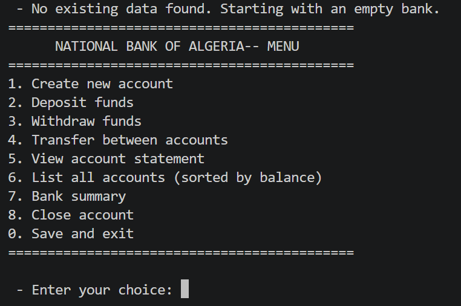
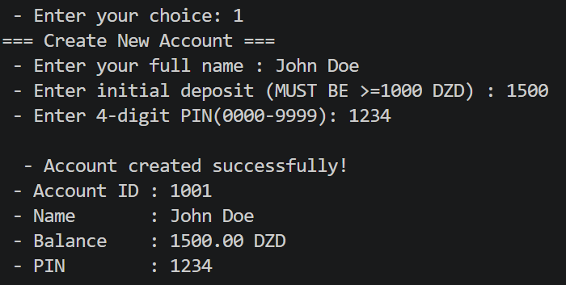
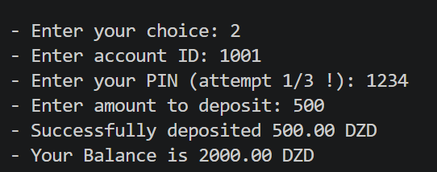
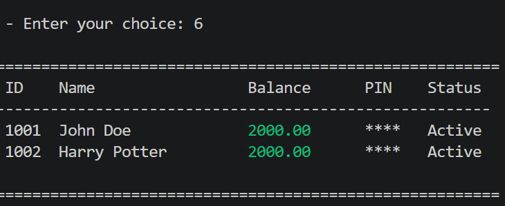

# 🏦 Bank Management System in C

## 👤 Author

Benaouda Aya

First-Year Computer Science — 2025/2026

---

## 📌 Description

This project is a simple **Bank Management System** developed in the C programming language.

It simulates basic banking operations using a menu-driven interface and stores data using arrays and file handling.

The system also includes **PIN verification** and **error handling** to ensure secure and reliable operations.

---

## ⚙️ Features

* Create new bank accounts
* Deposit money into accounts
* Withdraw money safely
* Transfer money between accounts
* View account details
* Close accounts securely
* Maximum of **50 accounts**
* Unique account ID generation
* PIN-based authentication
* File-based data persistence (`bank_data.txt`)

---

## 🛠️ How to Compile

```bash
gcc -Wall-Wextra-std=c11-lm main.c -o bank.exe
```

---

## ▶️ How to Run

### Windows:

```bash
bank.exe
```

### Linux / Mac:

```bash
./bank
```


---

## 📸 Screenshots

### Main Menu


### Create Account


### Deposit Funds


### Accounts List


---


## 🧪 Test Cases

The file `test_cases.txt` contains multiple test scenarios (minimum 5), including:

* Account creation
* Deposits
* Withdrawals
* Transfers
* Error handling cases

---

## 📁 Project Structure

```
main.c            → Full source code
README.md         → Project documentation
test_cases.txt    → Test scenarios
bank_data.txt     → Stored account data (auto-generated)
```

---

## 🚀 Notes

* Data is automatically saved when exiting the program
* Accounts are loaded on program startup
* PIN verification is required for sensitive operations

---

## 📌 Status

✔ Completed Project — First-Year C Programming Assignment
